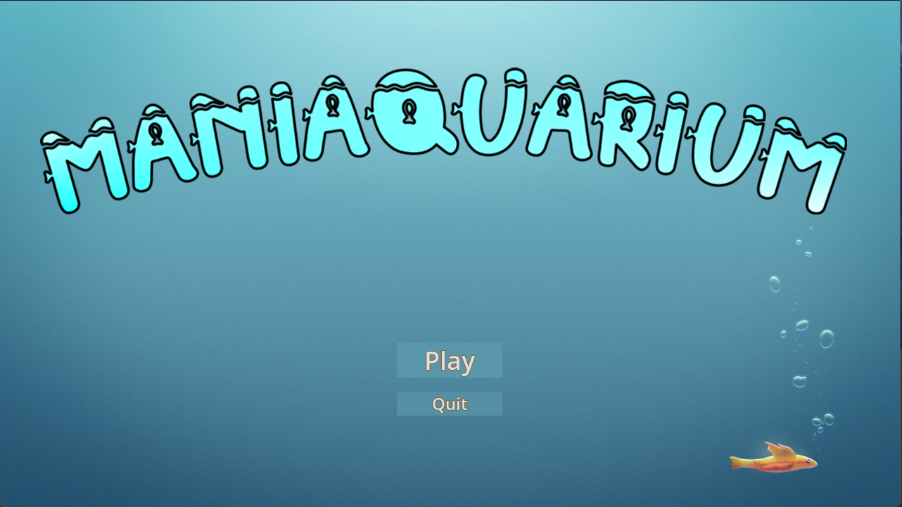
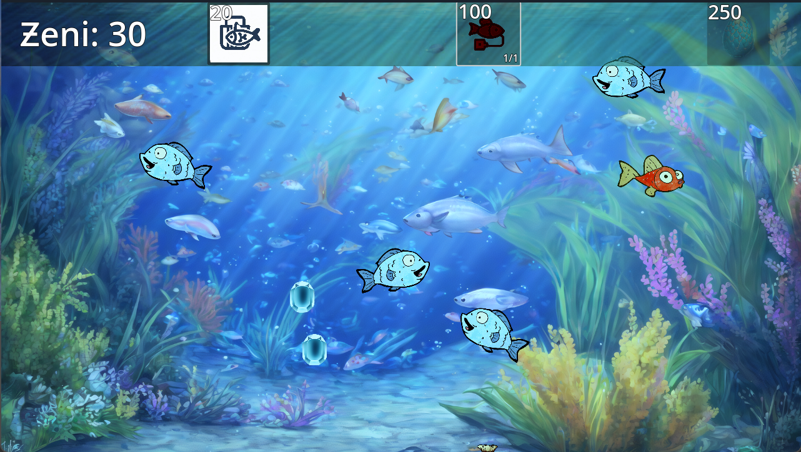

# Maniaquarium
 Insaniquarium-inspired mini-game to get me familiar with Godot 4. 🐠

To inspect the code, look for files ending with `.gd` within the [scenes/](scenes/) folder.

To play the game, download and extract `Maniaquarium 1.x.zip`. Run `Maniaquarium 1.x.exe`.
Download here: [Maniaquarium v1.2](https://drive.google.com/drive/folders/1mM8UUdpw07lqwwZZ4oGBmYSHHPUQNE9d?usp=sharing) (Google Drive link)

Future games will most likely be hosted and available on itch.io.

## Screenshots

